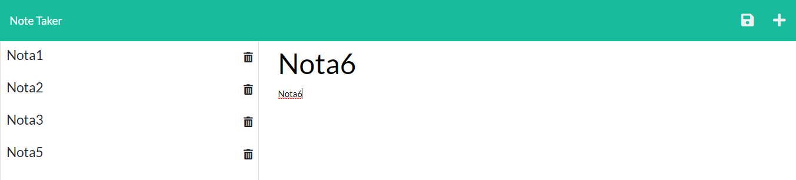

# P9-Note-Taker

## App Description
In this app you will be able to write personal notes and save them into a server. You will also be able to delete them in case you want to do it.

## Screenshot

## Using the Note Taker
### Writing and saving a new note
Every time you want to save a new note, you just have to click the + icon and the inputs will show up. Once you have filled with values both the title and the text area, a save icon will appear for you to save the note. It's required that you do not left empty any of the inputs, otherwise the save icon won't appear.

### Deleting notes
Whenever you want to delete an existing note, the only thing you need to do is to click the trash icon next to your saved notes and instantaneously the note will dissapear from your history of notes.

### Checking a note
Whenever you want to check a note, you would only need to click in the desired note and the information related to that note will show up to the right.

## Link to the app
